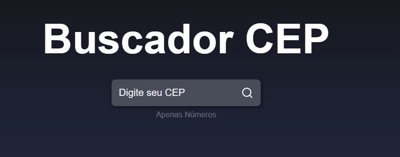
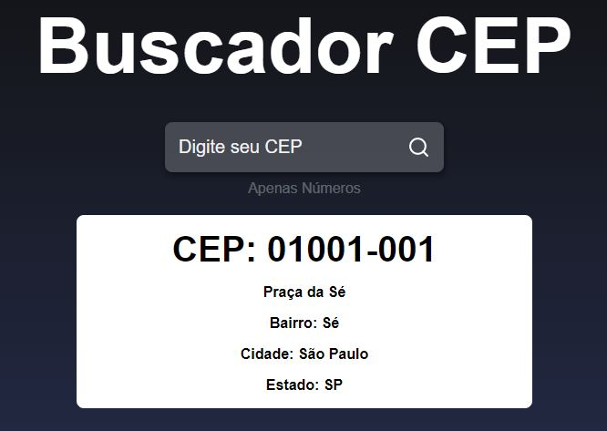

# Buscador de CEP

Projeto feito a partir do vídeo do Matheus do canal [Sujeito Programador](https://www.youtube.com/watch?v=oy4cbqE1_qc&t=1s) 

## Como usar

Bastar digitar o cep (sem traço) e clicar no ícone da lupa para procurar 

## Ferramentas Utilizadas

Neste projeto foi utilizado:

- HTML
- CSS
- JavaScript
- React
- Api Via CEP
- Axios
